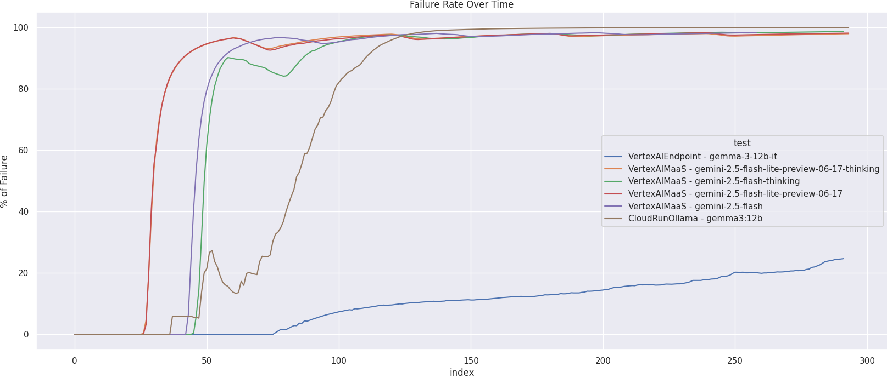
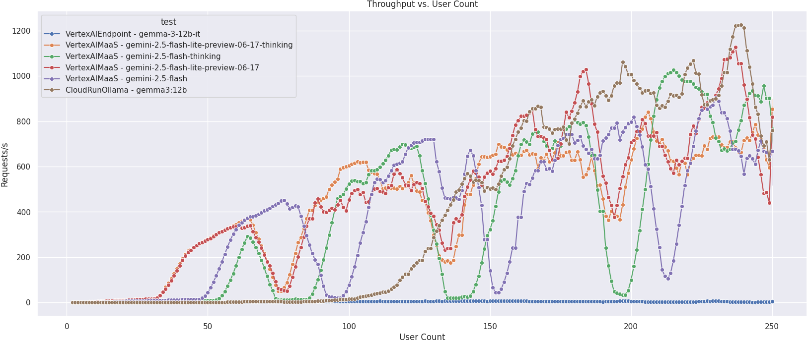
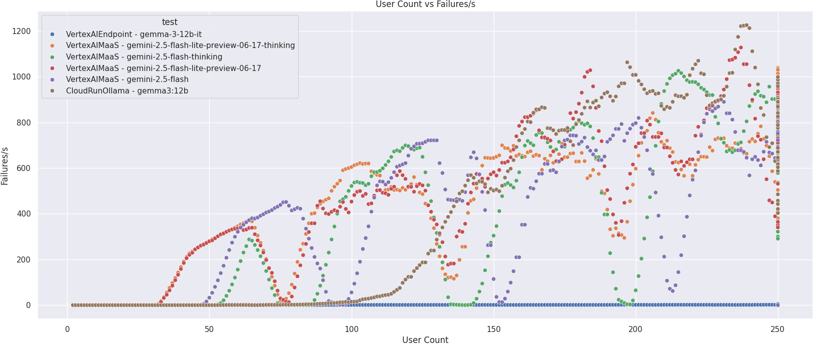
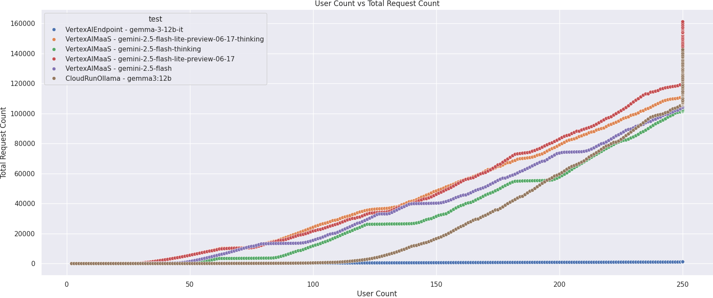

# GCP LLM Serving Benchmarks

This project provides a comprehensive benchmark analysis of various solutions for serving Large Language Models (LLMs) on Google Cloud Platform (GCP). The goal is to evaluate the scalability, performance, and cost-effectiveness of each approach to provide clear guidance for deploying LLM applications.

For a detailed analysis and discussion of the results, please refer to the Medium article: [Scaling the Summit: Challenges for Serving LLMs at Scale on GCP](https://fmind.medium.com/scaling-the-summit-challenges-for-serving-llms-at-scale-on-gcp-e0211efcdbbf)

## Benchmark Setup

The load testing is performed using `locust`, as defined in `locustfile.py`. The script simulates a ramp-up of concurrent users, sending prompts from the `databricks-dolly-15k` dataset to the different LLM serving solutions. The `locustfile.py` defines different user classes for each of the tested solutions: `VertexAIMaaS`, `VertexAIEndpoint`, and `CloudRunOllama`.

## Analysis

The analysis of the benchmark results is performed in the `analysis.ipynb` notebook. The notebook loads the raw data from the `results/` directory, processes it using `polars`, and generates visualizations with `seaborn` to compare the performance of the different solutions.

## Solutions Under Review

We are evaluating the following four serving configurations to understand their trade-offs.

### 1. Vertex AI for First-Party Models

- **Description**: This approach uses Google's fully managed, serverless AI platform, **Vertex AI**, to serve Google's own state-of-the-art models.
- **Model**: Gemini 2.5

### 2. Vertex AI for Open Models (Optimized)

- **Description**: Leveraging **Vertex AI Model Garden and Endpoints** with pre-built, optimized containers for serving popular open-source models.
- **Model**: Gemma 3

### 3. Cloud Run + GPU

- **Description**: A serverless approach where the open-source model is packaged into a container and deployed on **Cloud Run**.
- **Model**: Gemma 3

### 4. GKE + High-Performance Serving Framework (vLLM)

- **Description**: This option involves deploying the model on a **Google Kubernetes Engine (GKE)** cluster using a specialized, high-performance serving framework like **vLLM**.
- **Model**: Gemma 3

## Excluded Options

- **Compute Engine (GCE)**: This approach requires significant manual setup and operational overhead.

## Key Visualizations

**Failure Rate Over Time**

**Throughput vs. User Count**

**User Count vs. Failures**

**User Count vs. Total Request Count**

